# Codex Harness 到 DeepSeek Harness 的 Git 隔离与交付能力迁移报告

## 1. 执行摘要

DeepSeek Harness 当前把逻辑 Workspace、Session 执行目录和 Git checkout 绑定为同一个路径。多个 Session 选择同一 Workspace 时，会在同一个工作树中并发写入；Session Fork 与原生 Codex Subagent 也继承父 Session 的 `cwd`。因此，一个 Session 的删除、重写、清理或 `git` 操作可以直接破坏另一个 Session 尚未提交的代码。

值得从 Codex Harness 迁移的核心不是某个提示词或单独的自动 Commit Hook，而是一条由 Host 持有权限的 Git 交付控制面：

```text
逻辑 Workspace
  -> Session 独占 Git worktree 与 branch
  -> Agent 只负责实现
  -> Host 在明确完成边界执行验证与 Commit
  -> 仓库级 Integration Queue 串行 rebase/验证/fast-forward
  -> 确认目标分支包含 integration SHA 后清理
```

建议分四级迁移：

1. **P0：隔离与不丢代码**——Workspace/checkout 解耦、Session Git Lease、Host-owned Commit、Integration Queue、崩溃恢复和安全清理。
2. **P1：交付正确性**——轻量任务契约、路径权限、验收命令、精确候选审查和结构化 Receipt。
3. **P1：并发 Agent 安全**——写入型 Subagent 独立 worktree；只读 Reviewer 可以共享候选 checkout，但必须被写权限拒绝。
4. **P2：自治治理**——稳定 work ID、重试与时间预算、重复失败熔断、结构化人工升级。

不建议首批迁移 Reality 项目的 Godot 专属校验、玩家结果字段、特殊缓存清理、完整 Blame Analyzer、Loop Lab 或依靠 Stop Hook 强制工作流。这些能力不能解决最先发生的文件互删问题，反而会扩大改动面。

## 2. 审计范围与证据边界

本报告基于以下本地状态：

- DeepSeek Harness fork：`custom/port-rc8`，报告开始前提交为 `93133cb9f2`，本地 `upstream/master` 为 `141eb6fef8`（`dsh-v0.1.0-rc.8`）。未联网刷新远端引用。
- Codex Harness 参考实现：`E:/Automation/Reality-Godot-e2e`，读取时 Git HEAD 为 `7968d881a1`。该 checkout 有既存未提交修改，因此本报告只把源码、SSOT 和测试交叉一致的控制面行为视为参考。
- 本报告讨论 DSH 的代码 Session、Headless 代码任务和会写文件的 Subagent。普通问答 Session 不应被强制创建 Git worktree。

证据分为三类：

- **已确认现状**：由 DSH 当前源码直接证明。
- **可迁移参考**：Codex Harness 当前源码、SSOT 和测试已经表达的行为。
- **设计建议**：为适配 DSH 的持久 Session、插件体系和 Workspace UI 所作的工程判断，不声称已经实现。

## 3. 当前根因

### 3.1 多个 Session 共用同一执行目录

`packages/host/apiproxy/src/api-proxy.ts` 的 Session 创建路径把执行 `cwd` 解析为：

```text
workspace.path ?? request.cwd ?? defaults.cwd
```

当两个 Session 选择同一个 Workspace 时，它们得到相同的 `cwd`。当前 Workspace 只是持久化的用户目录及 Session 分组，不是执行 checkout 分配器。

### 3.2 Workspace 与 Session cwd 被强制视为同一身份

`packages/workspace/workspace/src/entity.ts` 的 `attachSession()` 会对 Session Header 中的 `cwd` 执行 `realpath`，并要求它与 Workspace Record 的 `path` 完全相等。这意味着不能只在 Session 创建时偷偷把 `cwd` 换成 worktree：换掉后，Session 将无法挂回用户选择的逻辑 Workspace。

迁移必须先拆开两个概念：

| 概念 | 含义 | 生命周期 |
|---|---|---|
| Logical Workspace | 用户选择、UI 分组、项目身份、原始仓库入口 | 长期存在 |
| Execution Checkout | 某个代码任务实际写入的 Git worktree | Session/任务级、可清理 |

### 3.3 Session Fork 只复制会话历史，不隔离 Git

当前 Fork 会创建新的 Session ID 和历史 seed，但 `cwd` 直接继承源 Session。Fork 后的两个会话仍在同一目录写入。历史隔离不等于文件系统隔离。

### 3.4 原生 Codex Subagent 不继承 Codex Desktop 的任务分支能力

`packages/subagent/subagent-codex/src/index.ts` 读取父 Session 的 `cwd`，`packages/subagent/subagent-codex/src/run.ts` 再以该目录启动 `codex app-server` 和 Codex thread。它使用的是 DSH 提供的目录，不会自动创建 Codex Desktop 风格的独立任务 branch。

因此，安装 `@deepseek-ai/dsh-subagent-codex` 或 `dsh-codex-enhancements` 不能解决共享工作树问题。现有 Agent Note 也明确把 worktree isolation 列为 bundle 之外的能力。

### 3.5 Agent 自己 Commit 不是可靠的交付边界

提示 Agent “完成后记得 Commit”存在以下失败模式：

- Agent 自然结束但忘记 Commit。
- Agent 执行 `git add -A`，把其他 Session 的半成品一起提交。
- Agent Commit 了，但没有验证 Commit 是否包含全部应交付路径。
- Agent 在共享 branch 上重置、切换或清理，破坏其他 Session。
- Agent 把一次对话 Stop 误当作整个代码任务完成。

Commit、合并与清理必须由知道 Session 身份、worktree、目标分支和验收状态的 Host 执行。

## 4. 迁移目标与非目标

### 4.1 目标

1. 两个代码 Session 默认不能看见或修改对方的未提交文件变化。
2. 每个候选变更都能追溯到 Session、逻辑 Workspace、base SHA、branch、worktree 和 Commit。
3. Agent 成功退出不等于交付；Host 必须创建或验证 Commit。
4. 并行开发不锁整个仓库，只串行化短暂的目标分支发布阶段。
5. 冲突、验证失败、进程崩溃和 main 变化都保留候选，不静默删除代码。
6. 清理只发生在确认 integration SHA 已进入目标分支之后。
7. Reviewer 审查的是精确 candidate SHA，并且不能修改候选工作树。
8. 普通交互模式保持低摩擦；重型任务契约只在自治或高风险工作中强制。

### 4.2 非目标

- 不把 Reality 项目的 Godot、Navigator、画面分辨率或资源流水线规则迁入 DSH Core。
- 不重写 DSH 的 Session 日志、Agent Loop、Subagent continuation 或权限体系。
- 不让 Git Ledger 取代 DSH Session log 成为第二份对话真源。
- 不在每个 `turn/end`、每次文件写入或普通 Stop 时创建 Commit。
- 不让 Worker 自行决定是否 Merge、清理或放宽自己的任务权限。
- 不在第一阶段实现自动冲突解决、跨仓库任务或多层 Agent branch stacking。

## 5. 应迁移能力总表

| 能力 | 优先级 | 迁移结论 | DSH 适配方式 |
|---|---:|---|---|
| 每任务独立 worktree/branch | P0 | 必须迁移 | 新增 Host 侧 Session Checkout capability |
| Host-owned Finalize 与 Commit | P0 | 必须迁移 | 明确完成命令/UI/Headless terminal boundary 触发 |
| 仓库级 Integration Queue | P0 | 必须迁移 | Git common dir 下的跨进程锁，fast-forward only |
| Commit 后才允许合并 | P0 | 必须迁移 | Candidate SHA 成为集成输入，不接受纯工作树 |
| 合并后才允许清理 | P0 | 必须迁移 | 先证明目标分支 ancestry，再删 worktree/branch |
| 崩溃检测和恢复证据 | P0 | 必须迁移 | 持久 lease 状态、进程锁、recovery ref |
| 路径所有权与只读/禁止路径 | P1 | 值得迁移 | 轻量 `CodeTaskSpec`，自治任务强制、交互任务可渐进 |
| 验收命令与 scoped validation | P1 | 值得迁移 | Finalizer 执行，命令和结果写入 Receipt |
| CompletionPacket/DeliveryReceipt | P1 | 值得迁移 | 使用 DSH durable domain，Session log 记录摘要事件 |
| 独立只读 Reviewer | P1 | 风险分级迁移 | 高风险、权限边界、验证失败后强制 |
| target advance 使 review 失效 | P1 | 必须配套 Reviewer | ReviewRequest 固定 target SHA 与 candidate SHA |
| 写入型 Subagent worktree 隔离 | P1 | 值得迁移 | 子 Agent 返回 Commit，不直接共享父 checkout |
| 稳定 work ID 与重试预算 | P2 | 自治模式迁移 | 绑定工作目标，不绑定可更换的 Session/branch/model |
| 结构化本地修复与人工升级 | P2 | 值得迁移 | 只允许同 scope 修复，扩权必须人工决定 |
| 被动 VCS 遥测 | P2 | 值得迁移 | Ledger 可重建，失败不得阻止 Agent 生命周期 |
| Stop Hook 强制 Commit | 不迁移 | 不建议 | Stop 只提示；真正 Gate 放在 Finalize |
| 完整 Blame/Loop Lab | 暂缓 | 不解决首要事故 | 等隔离和交付流水线稳定后再评估 |

## 6. 目标架构

```mermaid
flowchart LR
  User["User / Web / Headless"] --> Ingress["Session ingress"]
  Ingress --> Workspace["Logical Workspace Registry"]
  Ingress --> Lease["Session Checkout Manager"]
  Lease --> Git["Local Git Worktree Provider"]
  Git --> WT["Session-owned worktree + branch"]
  WT --> Agent["DSH Agent / Codex child"]
  Agent --> Finalize["Host Finalizer"]
  Finalize --> Validate["Scope + acceptance validation"]
  Validate --> Commit["Candidate Commit"]
  Commit --> Review["Optional read-only reviewer"]
  Review --> Queue["Repository Integration Queue"]
  Queue --> Main["Target branch"]
  Main --> Receipt["Delivery Receipt"]
  Receipt --> Cleanup["Worktree / branch cleanup"]
  Lease --> State["Durable checkout state"]
  Finalize --> State
  Queue --> State
  Cleanup --> State
```



### 6.1 能力边界

建议按 DSH 的 capability seam 设计，而不是把 Git 命令直接塞进 Agent Loop：

1. **Service Definition**：声明 Session Checkout、Finalize、Integrate、Abandon 和状态查询接口。
2. **Service Provider**：本地 Git worktree/branch 实现；未来远程 sandbox 可以提供另一实现。
3. **Consumers**：Web Session 创建、Session Fork、Headless runner、Codex Subagent、交付 UI 与运维命令。

建议的 `ctx` 服务名和包名只是候选：

| 候选包 | 责任 |
|---|---|
| `packages/workspace/session-checkout/` | Service Definition、状态类型、Session/Workspace 关联 |
| `packages/workspace/session-checkout-git/` | 本地 Git worktree Provider、锁、Git 操作 |
| `packages/workspace/session-delivery/` | Finalize、验收、Commit、Review Request、Integrate、Receipt |
| `packages/client/ui-workspace/` | 显示 branch、阶段、冲突、恢复和交付按钮 |
| `packages/host/apiproxy/` | Session 创建/Fork 入口调用 Checkout service |
| `packages/bundle/headless/` | 一次性任务结束后调用 Finalize，而不是只看 Agent stop reason |
| `packages/subagent/subagent-codex/` | 从 Checkout service 获取隔离 cwd，或明确声明只读共享 |

最终包名应在实现前按 DSH package family 规则确认，但责任边界不应合并回 `agent-loop`。

## 7. 核心数据模型

### 7.1 `SessionCheckoutRecord`

建议使用 `ctx.storageDomain` 持久化，而不是只放内存：

```json
{
  "schemaVersion": "SessionCheckout.v1",
  "sessionId": "session-...",
  "workspaceId": "workspace-...",
  "repositoryRoot": "E:/project",
  "gitCommonDir": "E:/project/.git",
  "targetBranch": "main",
  "baseSha": "...",
  "taskBranch": "dsh/session-...",
  "worktreePath": "C:/Users/.../.dsh/worktrees/<repo>/<session>",
  "phase": "active",
  "candidateSha": null,
  "reviewedTargetSha": null,
  "integrationSha": null,
  "cleanup": {
    "worktreeRemoved": false,
    "branchDeleted": false
  }
}
```

关键不变量：

- 一个 live writable Session 最多有一个 active checkout。
- 一个 checkout 只属于一个根 Session 或一个明确的写入型子任务。
- `taskBranch` 在 Git common dir 中唯一。
- `worktreePath` 必须位于受管根目录内，不能位于源仓库或另一个 worktree 内。
- `candidateSha` 必须是 `taskBranch` 的 Commit，不能用未提交工作树代替。
- `integrationSha` 必须可从 `targetBranch` 到达，才能进入 cleanup。
- 状态未知、路径逃逸、锁不一致或 worktree 注册关系异常时 fail closed。

### 7.2 `CodeTaskSpec`

不建议原样移植 Reality 的 `TaskBrief.v1`。DSH 需要更轻的通用契约：

```json
{
  "schemaVersion": "CodeTaskSpec.v1",
  "objective": "...",
  "targetBranch": "main",
  "baseSha": "...",
  "ownedPaths": ["packages/foo/**"],
  "readOnlyPaths": ["docs/architecture.md"],
  "forbiddenPaths": [".env", ".git/**"],
  "acceptanceCommands": [
    { "id": "focused", "command": "pnpm vitest ...", "required": true }
  ],
  "risk": "medium",
  "reviewPolicy": "deterministic",
  "maxRepairRounds": 1
}
```

适用策略：

- 交互式代码 Session 可以先使用仓库级默认 scope，并对凭据、Git 内部目录和宿主配置设置硬禁止路径。
- Headless、计划任务、批量任务和多 Agent 写入任务必须提供显式 `CodeTaskSpec`。
- 路径 scope 是 Commit 权限，不是文件读取权限；只读分析仍可读取任务需要的仓库内容。

### 7.3 `DeliveryReceipt`

Receipt 至少记录：

- Session、Workspace、work ID、attempt ID。
- base、candidate、reviewed target、integration SHA。
- 真实 changed paths 和 staged paths。
- 每条验收命令、exit code、持续时间、是否 required。
- Reviewer verdict 和是否发生 target advance。
- worktree/branch cleanup 结果。
- 已知风险、未解决项、失败责任阶段。

Receipt 是交付证据，不应存放 API key、完整环境、完整 Prompt 或不受限 stdout/stderr。

## 8. 生命周期设计

### 8.1 新建代码 Session

1. 用户选择 Logical Workspace。
2. Host 解析仓库根、Git common dir、目标分支和当前 target SHA。
3. 在创建 Agent 之前取得 Session/work OS 锁。
4. 在受管目录创建唯一 branch 和 worktree。
5. 持久写入 `prepared` 状态。
6. 以 worktree 路径创建 Session Header `cwd` 和 Agent scope。
7. 把 Session 通过显式 `workspaceId` 关联到 Logical Workspace，不再用 `cwd == workspace.path` 推断归属。
8. Agent 开始运行，状态进入 `active`。

分配必须发生在 Agent 获得写权限之前。提示词里写“请不要碰别人的文件”不是隔离。

### 8.2 正常实现阶段

- Agent、Shell、FS、LSP、Terminal 和 Codex child 必须看到同一个 Session worktree。
- Host 可以被动记录 mutation paths，但不在每次写入后 Commit。
- 只要 Session active，另一个进程不能 Finalize、Integrate、Abandon 或删除其 worktree。
- 不持续把 main Merge 到正在编辑的 Session。只在显式 finalization/reconciliation 边界同步。

### 8.3 Finalize 与 Commit

Finalization 不能等同于普通 `turn/end`。建议触发源：

- Web UI 的“验证并交付”动作。
- 明确的 Host 命令，例如 `/deliver` 或非模型 RPC。
- Headless 一次性任务得到 `completed` 后，由 runner 自动调用。
- Goal 模式的目标达成事件，但仍需经过同一个 Finalizer。

Finalizer 顺序：

1. 取得 Session/work 锁，确认没有 Agent 继续写入。
2. 读取 Git 状态并构造精确 changed path 集合。
3. 拒绝 forbidden/read-only/unowned 变更。
4. 运行 required acceptance commands。
5. 验证 acceptance 没有产生未声明的新变更或危险 residue。
6. 只暂存允许路径；禁止 `git add -A`。
7. 创建 Commit，或验证 Agent 已创建的 Commit 完全符合候选范围。
8. 要求 worktree 回到可解释的 clean 状态。
9. 写入 candidate SHA 和 CompletionPacket。

Agent 的零退出、自然语言“完成了”或测试输出不能代替 candidate Commit。

### 8.4 Review

Reviewer 只接收冻结的任务契约、candidate SHA、target SHA、diff 和验收证据：

- Reviewer 使用只读权限。
- Review 前后比较 worktree 状态；任何 Reviewer mutation 都使审查失败。
- Verdict 必须结构化，区分 accepted、local repair、human decision 和 block。
- ReviewRequest 同时固定 candidate SHA 和 target SHA。
- 如果 main 在 Review 后前进，旧 verdict 失效；不能把未审查的新 rebase 结果直接发布。

风险分级建议：

| 风险 | 默认 Gate |
|---|---|
| low | scope + focused tests + clean candidate |
| medium | scope + focused tests + package/type checks；按规则决定 Reviewer |
| high | deterministic gates + 独立只读 Reviewer |
| 权限、凭据、发布、数据库迁移 | 独立 Reviewer + 必要的人类 Gate |

### 8.5 Integrate

Integration Queue 是仓库级短临界区，不是全局开发锁：

1. 取得 Git common dir 下的 Integration Queue 锁。
2. 读取最新 target SHA。
3. 如果目标变化，rebase candidate 并重新运行 scope/acceptance；需要 Reviewer 的任务产生新 ReviewRequest。
4. 确认 target ref 仍是预期 SHA。
5. 只允许 fast-forward 更新目标分支。
6. 写入 integration SHA 和 delivered 状态。
7. 释放 Queue 锁。

冲突、脏 target checkout、验收失败或非 fast-forward 更新都必须保留 candidate branch，不得自动丢弃。

### 8.6 Cleanup

Cleanup 前置条件：

- integration SHA 可从 target branch 到达。
- Session/process 锁空闲。
- worktree 没有未归档的未提交内容。
- 当前清理进程的 cwd 不在待删 worktree 中。

然后按顺序：移除 Git worktree、删除已合并 task branch、写入 cleanup flags、最终发布 Receipt。

若 Cleanup 失败，交付状态应为“已集成但清理未完成”，不能谎称完整完成；下一次运维操作只重试清理，不重复 Merge。

### 8.7 Abandon 与恢复

未发布候选不能被静默删除：

- dirty worktree 默认拒绝 abandon，除非操作者明确允许 discard。
- discard 前记录受限 diff、untracked 文件大小与 hash，避免把内容写入无限日志。
- 已 Commit 候选创建 `refs/dsh/recovery/<session>/<timestamp>` 后才允许删除 branch/worktree。
- 冲突候选保留 branch 和 Receipt，供用户打开、比较或手工修复。

### 8.8 Crash recovery

如果进程重新取得空闲锁后仍发现状态为 `running`，说明旧 runner 已崩溃：

- 不继续一个身份不明的写入进程。
- 标记原 attempt 为 crashed/abandoned。
- 保存 dirty evidence 或 recovery ref。
- 由 Host 决定是否从同一 candidate 创建新的 bounded repair attempt。

不能仅根据 PID 文件判断存活；PID 可能复用。锁与持久状态必须共同参与判定。

## 9. 持久 Session 与 worktree 生命周期的冲突

DSH Session 可以长期恢复，而 Session Header 的 `cwd` 是创建时固定事实。Codex Desktop 的“一任务一 branch，交付后清理”不能无条件照搬，否则已清理 Session 再次继续时没有有效 cwd。

首版建议采用 **task-scoped code session**：

- 一个 writable code Session 对应一个 Git lease 和一个交付任务。
- delivered/cleaned 后，该 Session 仍可查看历史，但不再直接写入旧 checkout。
- 用户点击继续开发时，Host 自动 Fork 为新 Session：继承会话 seed，但从最新 target 创建新 branch/worktree。
- 普通聊天 Session 不受此约束。

替代方案是让一个 Session 长期保留稳定 worktree，并在每次交付后复用 branch；这会延迟清理、增加 stale checkout 和状态修复复杂度，不建议作为第一版。

## 10. Session Fork 语义

Fork 必须同时定义对话历史与 Git 基线：

- **已交付父 Session**：子 Session 从最新 target SHA 创建 worktree，继承对话 seed。
- **有 clean candidate Commit 的 active Session**：可选择从 candidate SHA 派生子 branch，并明确它尚未进入 main。
- **父 Session 有未提交变更**：默认拒绝 writable fork；可以先由 Host 创建 checkpoint Commit，或只创建 read-only fork。
- **纯分析 Fork**：可以共享只读 checkout，但 FS、Shell、Terminal 都必须实际拒绝写入。

不能继续使用“新 Session ID + 相同 cwd”作为 writable fork。

## 11. Subagent 策略

### 11.1 只读 Subagent

适合 Reviewer、代码探索、测试结果分析：

- 可以共享父 candidate worktree。
- 必须配置实际只读 FS/Shell policy，而不是只写 Prompt。
- 运行前后比较 Git status，检测越权 mutation。

### 11.2 写入型 Subagent

首版最安全策略是：父 Session active 时禁止另一个写入型 Subagent 共用其 checkout。

后续可增加 child worktree：

1. 从父 candidate/base Commit 创建 child branch/worktree。
2. Child Agent 只返回 Commit SHA、结果和证据。
3. 父 Session 的本地 Integration Queue 把 child Commit rebase/cherry-pick 到父 branch。
4. 冲突保留 child branch，由父 Agent或用户处理。

Subagent Ledger 只观察这些生命周期事件；Ledger 写入失败不应阻止 Agent，但 Git Lease/Commit/Integrate 权威状态写入失败必须 fail closed。

## 12. 锁与并发模型

至少需要两级锁：

| 锁 | 粒度 | 保护对象 |
|---|---|---|
| Session/work lock | 一个 checkout/work ID | prepare、Agent run、finalize、abandon、cleanup 互斥 |
| Integration Queue lock | 一个 Git common dir | rebase/validate/target ref update 串行 |

要求：

- 使用 OS 持有的跨进程锁，不以“锁文件存在”代替锁。
- 锁文件可以持久存在；是否 busy 由 OS lock 决定。
- 在创建 branch/worktree 前先取得 work lock，避免两个 Host 同时分配同一 Session。
- Integration Queue 只覆盖必要的 Git reconciliation 和 ref publication，不覆盖 Agent 的整个工作时间。
- DSH 当前 `storageDomain` 只保证单进程写链，不能单独承担跨进程 Git 锁。

## 13. 安全边界

1. 所有 worktree 必须位于配置的受管根目录内，并验证 `realpath`。
2. 拒绝 symlink、junction、reparse point 导致的清理路径逃逸。
3. 不对源 Workspace 执行递归删除。
4. 禁止 Agent 直接调用 Host delivery API；Agent 只能提交完成意图和证据。
5. Worker 环境、Prompt 和 Receipt 不记录 credentials。
6. `git add` 使用精确 pathspec；不允许 `git add -A` 或对仓库根无差别暂存。
7. target branch 更新采用 compare-and-swap 语义；预期 SHA 不一致即失败。
8. 自动清理只删除 runtime 明确创建且状态匹配的 worktree/branch。
9. 清理失败保留状态供重试，不以强制删除掩盖问题。

## 14. DSH 现有能力应如何复用

| DSH 现有能力 | 复用方式 |
|---|---|
| Cordis plugin tree | Git delivery 作为可插拔 capability，不改 Agent Loop |
| `ctx.sessions` append-only log | 记录对模型可见的交付摘要、用户命令和状态变化 |
| `ctx.storageDomain` | 保存 checkout、attempt、review、receipt 等 Host 侧权威状态 |
| Workspace Registry | 保留逻辑项目与 UI 分组，但去掉 cwd 等同项目路径的假设 |
| Session Header cwd | 指向真实 Session worktree，保证 FS/Shell/LSP 同一执行世界 |
| Permission presets | 增加 writable code、read-only review 等组合策略 |
| Subprocess service | 运行 Git、验收命令和 Codex child，并继承现有进程树清理能力 |
| Session lifecycle events | 触发创建、归档、可观测状态投影，但不把普通 Stop 当交付 |
| Subagent Ledger | 消费 Git 生命周期事件形成可重建观测，不成为执行真源 |
| Goal/Headless runner | 提供明确任务完成边界，之后调用统一 Finalizer |

## 15. 分阶段迁移方案

### Phase 0：契约和事故回归测试

先写行为测试，不接真实模型：

- 两个 Session 对同一仓库获得不同 branch/worktree/cwd。
- Session B 删除文件时，Session A 的未提交文件不变化。
- Workspace UI 仍把两个 Session 分组到同一逻辑项目。
- writable Fork 不再继承同一 cwd。
- Codex Subagent 不能在未知共享 cwd 获得写权限。

退出条件：测试能稳定复现旧故障，并在新抽象的 fake provider 上通过。

### Phase 1：Session Checkout 隔离

实现最小 `SessionCheckout` seam 和本地 Git Provider：

- Web 新代码 Session 创建 worktree。
- Headless 代码任务创建 worktree。
- Session/Workspace 显式关联，不依赖 cwd equality。
- Session archive 提供安全 cleanup 入口。
- 暂不自动 Merge；先证明不会互删代码。

退出条件：真实 Web 双 Session 并发修改测试通过，源 Workspace 始终 clean。

### Phase 2：Host Finalize、Commit 与 Integration Queue

- 增加显式 Deliver UI/RPC。
- Host 运行 focused checks 并创建 candidate Commit。
- 实现 repo-level Integration Queue 和 fast-forward publication。
- 实现 Receipt、失败保留和 cleanup。
- Headless `completed` 接入同一 Finalizer。

退出条件：两个不冲突候选可并行开发并依次进入 main；冲突候选不丢失。

### Phase 3：任务 scope 与 Reviewer

- 引入 `CodeTaskSpec.v1`。
- 对自治任务强制 owned/read-only/forbidden path。
- 增加 CompletionPacket 和严格结构化 Verdict。
- 高风险任务启用独立只读 Reviewer。
- target advance 后旧 Review 自动失效。

退出条件：越权删除、Reviewer mutation、stale verdict、dirty target 都被确定性拒绝。

### Phase 4：Subagent 写隔离和有限自治

- 写入型 child worktree 与 parent-local integration。
- 稳定 work ID、attempt/time/repeated-signature budget。
- 最多一次同 scope 自动修复。
- 扩 scope、依赖、权限、验收和政策时生成 Human Escalation。

退出条件：重试无法通过换 Session、branch、model 绕过预算；父子并发写入不共享工作树。

## 16. 验收测试矩阵

### 16.1 隔离

- 两个根 Session 同时修改同一文件，各自 Git status 只包含自己的版本。
- 一个 Session 删除目录，另一个 Session 的目录仍存在。
- 两个 Session 执行不同 formatter，不互相产生 dirty path。
- 源 Logical Workspace 不出现 Agent 产生的工作树变化。

### 16.2 Commit

- Agent 忘记 Commit，Host Finalizer 能创建 candidate Commit。
- Agent Commit 不完整，Host 检测到未提交 owned path 并拒绝交付。
- unowned/read-only/forbidden 变更在暂存前被拒绝。
- 验收命令产生未知文件后，Finalize 失败并保留工作树。

### 16.3 Integration

- 两个不冲突候选按 Queue 顺序进入 main。
- target 在 Review 后前进，旧 Verdict 失效。
- rebase 冲突保留 candidate branch 和 worktree。
- target checkout 脏时阻止发布，不自动清理 target。
- compare-and-swap ref 更新失败时不重复 Merge。

### 16.4 Crash 与 Cleanup

- Agent 进程崩溃后，第二个 runner 不写入同一 worktree。
- stale running 状态被归档为 crash evidence。
- dirty abandon 需要显式 discard。
- 已 Commit abandon 创建 recovery ref。
- 只有 target 包含 integration SHA 后才删除 worktree/branch。
- cleanup 半失败可以幂等重试，不重复发布。

### 16.5 Subagent

- 只读 Reviewer 的写操作被权限层拒绝。
- Reviewer 前后 Git status 不同则 Verdict 无效。
- writable Codex child 不再使用父 Session cwd。
- child failure 保留 child branch；父 candidate 不被回滚或删除。

## 17. 上线与回滚策略

### 17.1 Feature flag / Bundle

先作为 opt-in bundle 部署到个人 `web` profile，不改变普通 DSH 默认行为：

- `checkoutMode: shared | worktree`
- `deliveryMode: manual | host-finalize`
- `reviewPolicy: none | risk-based | required`
- `targetBranch: main`
- `managedWorktreeRoot: <DSH_HOME>/worktrees`

配置错误必须在 Profile load 或首次可解析入口失败，不能静默退回 shared 模式。

### 17.2 Canary

1. 在临时 Git 仓库跑纯测试。
2. 在 fork 的非关键分支运行两个真实 DSH Session。
3. 验证冲突、崩溃和 cleanup，而不只验证 happy path。
4. 连续观察 Receipt 与 Git worktree list 是否一致。
5. 确认后再把 worktree 模式设为代码 preset 默认。

### 17.3 回滚

- 停止创建新 worktree lease。
- 已 active Session 继续由原 Provider 管理，不中途切回 shared cwd。
- 已 Commit candidate 保留 recovery ref。
- 只在确认没有 active lock 后卸载 bundle。
- 回滚不得删除未知 worktree 或用户创建的 branch。

## 18. 可观测性与指标

建议记录以下结构化指标，但默认本地保存：

- active/committed/integration-blocked/cleanup-pending checkout 数量。
- 从 Session 创建到 first mutation、candidate Commit、integration 的时间。
- Agent 忘记 Commit而由 Host 补交的次数。
- scope violation、acceptance failure、rebase conflict、dirty target 次数。
- crash recovery、recovery ref、cleanup retry 数量。
- Reviewer rejection、stale verdict、Reviewer mutation 数量。
- 写入型 Subagent 被共享 cwd policy 阻止的次数。

这些指标帮助判断控制面质量，不能用来自动删除候选或扩大 Agent 权限。

## 19. 不建议迁移的部分

### 19.1 Godot/Reality 专属 TaskBrief 字段

`player_outcome`、固定 Godot executable、特定缓存目录、Navigator 检查和 3440×1440 视觉 Gate 都是项目规则，不属于通用 DSH Harness。

### 19.2 每次 Stop 的硬阻断

Stop 可能只是等待用户回答、阶段性汇报或一次正常对话结束。最多记录未保存 batch 提示；真正的 `owned_paths_committed` Gate 应放在 Deliver/Finalize。

### 19.3 Worker 自我审批

Worker 不能以“测试通过”批准自己的 Merge，也不能自行扩大 scope、降低验收或清理失败证据。

### 19.4 一开始就迁移完整 Blame 系统

根因分类、弱点挖掘和策略优化可以后加。第一阶段只需准确区分：checkout/orchestrator、worker scope、validator、reviewer、integrator、cleanup infrastructure。

### 19.5 持续把 main 合入 active Session

频繁同步会在 Agent 写入过程中制造不稳定基线。新 Session 从最新 target 开始；运行中的 Session 只在显式 finalization/reconciliation 边界同步。

## 20. 推荐的第一实现切片

最值得立即实现的最小闭环是：

1. 新增 Logical Workspace 与 Execution Checkout 的显式关联。
2. Web 创建代码 Session 时分配独立 worktree/branch。
3. Codex Subagent 若请求写权限，必须使用独立 checkout；未接入前先禁止共享 cwd 写入。
4. 提供 Host `finalize`：读取 diff、运行一条配置验收命令、精确暂存、Commit。
5. 提供仓库级 `integrate`：锁、rebase、重新验证、fast-forward。
6. 证明目标分支包含 integration SHA 后 cleanup，并写 Receipt。
7. 用“双 Session 同文件编辑/删除”和“冲突保留候选”作为必须通过的 E2E。

这七项完成后，用户遇到的“没有 Commit、共用 branch、互相删除代码”三个事故会同时被结构性消除。Task scope、Reviewer、预算和自动修复可以在这个可信 Git 基础上继续叠加，而不需要先迁移整套 Codex/Reality Harness。

## 21. 最终建议

应当迁移 Codex Harness 的 **Git 隔离、Host 交付权限、串行发布、失败保留和精确审查**，而不是迁移它的全部项目治理内容。

DSH 已经拥有插件体系、持久 Session、权限、Subprocess、Workspace UI 和事件日志，缺的是把这些能力与 Git checkout 生命周期连接起来的 Host capability。只要这一层成为唯一的 writable code-session 入口，Agent 是否记得 Commit、使用什么模型、是否来自 Codex provider，就不再决定代码会不会被另一个 Session 删除。
